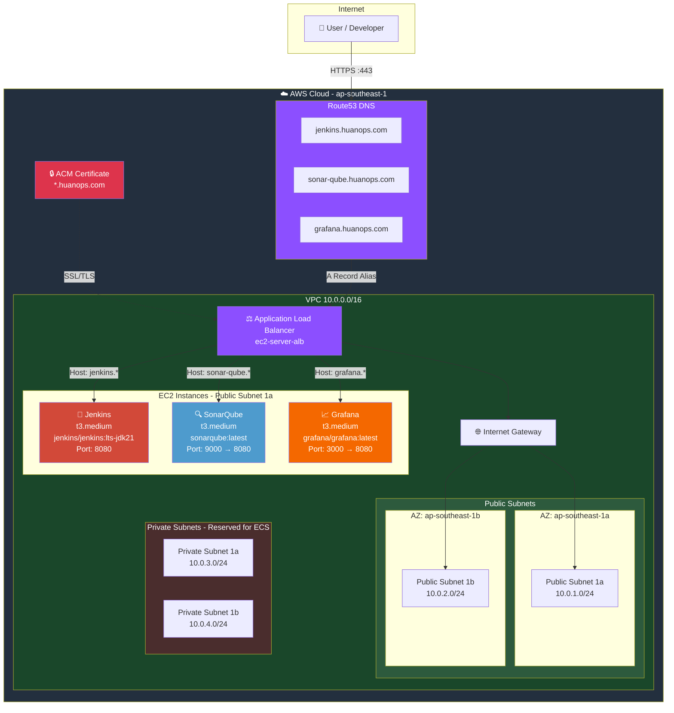
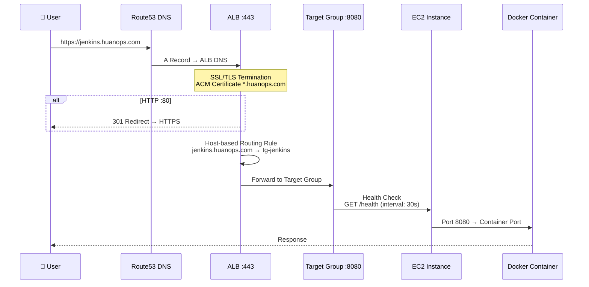
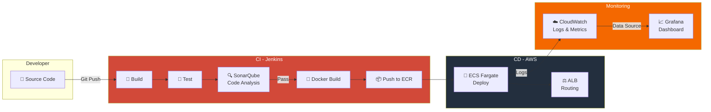
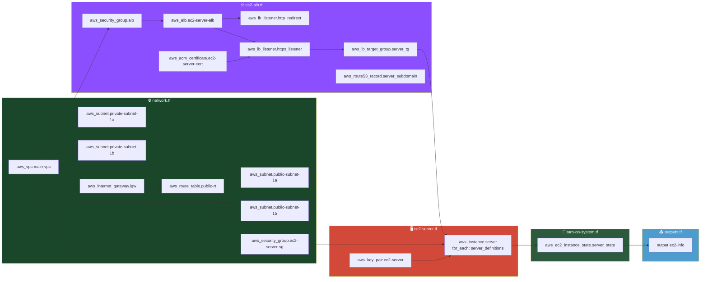

# AWS ECS Fargate CI/CD Pipeline

End-to-End Deployment of a FullStack Web Application (Spring Boot, ReactJS) with AWS ECS, Terraform, Jenkins, SonarQube, Trivy & CloudWatch/Grafana


## 📋 Mục lục

- [Tổng quan](#-tổng-quan)
- [Kiến trúc hệ thống](#-kiến-trúc-hệ-thống)
- [Sơ đồ Infrastructure](#-sơ-đồ-infrastructure)
- [Cấu trúc thư mục](#-cấu-trúc-thư-mục)
- [Chi tiết Infrastructure](#-chi-tiết-infrastructure)
- [Cách sử dụng](#-cách-sử-dụng)
- [Truy cập các dịch vụ](#-truy-cập-các-dịch-vụ)

---

## 🎯 Tổng quan

Dự án này triển khai một hệ thống CI/CD hoàn chỉnh trên AWS sử dụng Terraform. Hệ thống bao gồm:

- **Jenkins**: CI/CD automation server
- **SonarQube**: Code quality & security analysis
- **Grafana**: Monitoring & observability dashboard

---

## 🏗️ Kiến trúc hệ thống

### AWS Provider
- **Region**: `ap-southeast-1` (Singapore)
- **Terraform AWS Provider**: Version `~> 6.0`

### Network Architecture

#### VPC Configuration
| Resource | CIDR Block | Mô tả |
|----------|------------|-------|
| VPC | `10.0.0.0/16` | Main VPC với DNS hostnames enabled |
| Public Subnet 1a | `10.0.1.0/24` | AZ: `ap-southeast-1a`, Auto-assign public IP |
| Public Subnet 1b | `10.0.2.0/24` | AZ: `ap-southeast-1b`, Auto-assign public IP |
| Private Subnet 1a | `10.0.3.0/24` | AZ: `ap-southeast-1a` |
| Private Subnet 1b | `10.0.4.0/24` | AZ: `ap-southeast-1b` |

#### Network Components
- **Internet Gateway**: Cho phép truy cập internet cho public subnets
- **Route Table**: Public route table với route `0.0.0.0/0` → Internet Gateway

### Security Groups

#### ALB Security Group (`alb-sg`)
| Direction | Port | Protocol | Source | Mô tả |
|-----------|------|----------|--------|-------|
| Ingress | 443 | TCP | `0.0.0.0/0` | HTTPS access |
| Ingress | 80 | TCP | `0.0.0.0/0` | HTTP access |
| Egress | All | All | `0.0.0.0/0` | All outbound traffic |

#### EC2 Server Security Group (`ec2-server-sg`)
| Direction | Port | Protocol | Source | Mô tả |
|-----------|------|----------|--------|-------|
| Ingress | 8080 | TCP | ALB SG | Web access from ALB |
| Ingress | 22 | TCP | `0.0.0.0/0` | SSH access |
| Egress | All | All | `0.0.0.0/0` | All outbound traffic |

---

## 📊 Sơ đồ Infrastructure

### Tổng quan kiến trúc AWS



### Luồng Traffic (Network Flow)



### CI/CD Pipeline Flow (Dự kiến)



### Sơ đồ Terraform Resources



---

## 📁 Cấu trúc thư mục

```
infrastructure/
├── provider.tf           # AWS Provider configuration (ap-southeast-1)
├── network.tf            # VPC, Subnets, IGW, Route Tables, Security Groups
├── ec2-alb.tf            # ALB, ACM Certificate, Route53 DNS, Target Groups, Listeners
├── ec2-server.tf         # EC2 instances (Jenkins, SonarQube, Grafana) via for_each
├── outputs.tf            # Terraform outputs (EC2 instance details)
├── turn-on-system.tf     # EC2 instance state management (ensure running)
├── ecs.tf                # (Chờ triển khai - ECS Fargate)
├── iam-roles.tf          # (Chờ triển khai - IAM Roles cho ECS)
├── s3-bucket.tf          # (Chờ triển khai - S3 cho Frontend)
└── ec2-install/          # User data scripts (Docker installation + container run)
    ├── jenkins.sh        # Jenkins: jenkins/jenkins:lts-jdk21 → port 8080
    ├── sonar-qube.sh     # SonarQube: sonarqube:latest → port 9000→8080
    └── grafana.sh        # Grafana: grafana/grafana:latest → port 3000→8080
```

---

## 🖥️ Chi tiết Infrastructure

### EC2 Instances

Tất cả EC2 instances được tạo bằng `for_each` trên `server_definitions` variable:
- **AMI**: `ami-02fb5ef6a4a46a62d` (Amazon Linux)
- **Subnet**: Public Subnet 1a
- **Key Pair**: `ec2-key-pair` (từ `~/.ssh/ec2-server.pub`)
- **Volume**: gp3, delete on termination

| Server | Instance Type | Volume Size | Health Check Path | Docker Image | Port Mapping |
|--------|---------------|-------------|-------------------|--------------|--------------|
| Jenkins | `t3.medium` | 20 GB | `/health` | `jenkins/jenkins:lts-jdk21` | 8080:8080 |
| SonarQube | `t3.medium` | 20 GB | `/api/system/status` | `sonarqube:latest` | 8080:9000 |
| Grafana | `t3.medium` | 20 GB | `/api/health` | `grafana/grafana:latest` | 8080:3000 |

### Application Load Balancer

- **Name**: `ec2-server-alb`
- **Type**: Application Load Balancer (internet-facing)
- **Subnets**: Public Subnet 1a, 1b

#### Listeners & Routing

| Port | Protocol | Action |
|------|----------|--------|
| 80 | HTTP | Redirect to HTTPS (301) |
| 443 | HTTPS | Host-based routing → Target Groups |

**Routing Rules**: Mỗi server có listener rule riêng dựa trên `host_header`:
- `jenkins.huanops.com` → `tg-jenkins`
- `sonar-qube.huanops.com` → `tg-sonar-qube`
- `grafana.huanops.com` → `tg-grafana`

Default action (không khớp rule): trả về `404 - Service Not Found`.

### SSL/TLS Certificate

- **Domain**: `huanops.com` (wildcard: `*.huanops.com`)
- **Provider**: AWS Certificate Manager (ACM)
- **Validation**: DNS validation via Route53 (tự động)

### DNS Configuration (Route53)

Mỗi server được tự động tạo subdomain bằng `for_each`, trỏ A record alias về ALB:
- `jenkins.huanops.com`
- `sonar-qube.huanops.com`
- `grafana.huanops.com`

### Target Groups

Mỗi server có Target Group riêng (tự động tạo bằng `for_each`):
- **Port**: 8080
- **Protocol**: HTTP
- **Health Check**: 30s interval, 20s timeout, 2 healthy/unhealthy threshold
- **Matcher**: `200-399`

### Instance State Management

File `turn-on-system.tf` đảm bảo tất cả EC2 instances ở trạng thái `running` sau khi tạo.

---

## 🚀 Cách sử dụng

### Prerequisites

1. AWS CLI configured với credentials
2. Terraform installed (>= 1.0)
3. SSH key pair tại `~/.ssh/ec2-server.pub`
4. Domain `huanops.com` được quản lý trên Route53

### Triển khai

```bash
# Di chuyển vào thư mục infrastructure
cd infrastructure

# Khởi tạo Terraform
terraform init

# Xem trước các thay đổi
terraform plan

# Triển khai infrastructure
terraform apply
```

### Xem thông tin EC2 Instances

Sau khi triển khai, sử dụng command:

```bash
terraform output ec2-info
```

Output sẽ hiển thị thông tin chi tiết của từng instance bao gồm:
- Instance ID
- Public/Private IP
- Public/Private DNS
- Instance Type
- State
- Tags

---

## 🌐 Truy cập các dịch vụ

Sau khi triển khai thành công, truy cập các dịch vụ qua HTTPS:

| Service | URL | Container Port → Host Port |
|---------|-----|---------------------------|
| Jenkins | https://jenkins.huanops.com | 8080 → 8080 → ALB 443 |
| SonarQube | https://sonar-qube.huanops.com | 9000 → 8080 → ALB 443 |
| Grafana | https://grafana.huanops.com | 3000 → 8080 → ALB 443 |

---

## 📝 Ghi chú

### Files chưa triển khai

Các file sau đang để trống, dự kiến sẽ triển khai cho ECS Fargate:
- `ecs.tf`: ECS Cluster, Service, Task Definition
- `iam-roles.tf`: IAM Roles cho ECS
- `s3-bucket.tf`: S3 Bucket cho Frontend Static

### Docker Containers

Tất cả services được chạy dưới dạng Docker containers với:
- **Persistent volumes** để lưu trữ data
- **Auto-restart policy** (`--restart always`)
- **Port mapping** về port 8080 cho ALB health check
- **User data scripts** tự động cài Docker và chạy container khi EC2 khởi tạo

### Terraform Patterns

- **`for_each`** được sử dụng rộng rãi: EC2 instances, Target Groups, Listener Rules, DNS Records đều tạo từ `server_definitions` variable
- **`depends_on`** đảm bảo thứ tự: ACM validation → ALB Listener, EC2 → Instance State → Output

---

## 🔐 Bảo mật

- SSH access được mở cho tất cả IP (`0.0.0.0/0`) — **Khuyến nghị giới hạn theo IP cụ thể**
- HTTPS được enforce với redirect từ HTTP → HTTPS
- SSL certificate được validate qua DNS (tự động)
- Security Groups cấu hình: chỉ ALB mới có thể truy cập port 8080 trên EC2
- EC2 không cho phép truy cập trực tiếp port 8080 từ internet

---

## 📊 Monitoring

- **CloudWatch**: Thu thập logs và metrics từ ECS (dự kiến)
- **Grafana**: Dashboard visualization cho monitoring (đã triển khai)

---

## 🏷️ Tags

Tất cả resources được tag với:
- `Project`: `ECS-CI/CD`
- `Name`: Tên resource tương ứng
