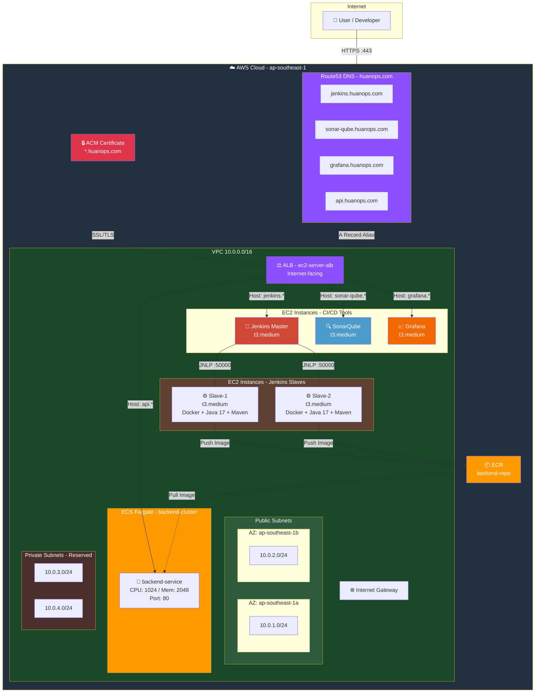
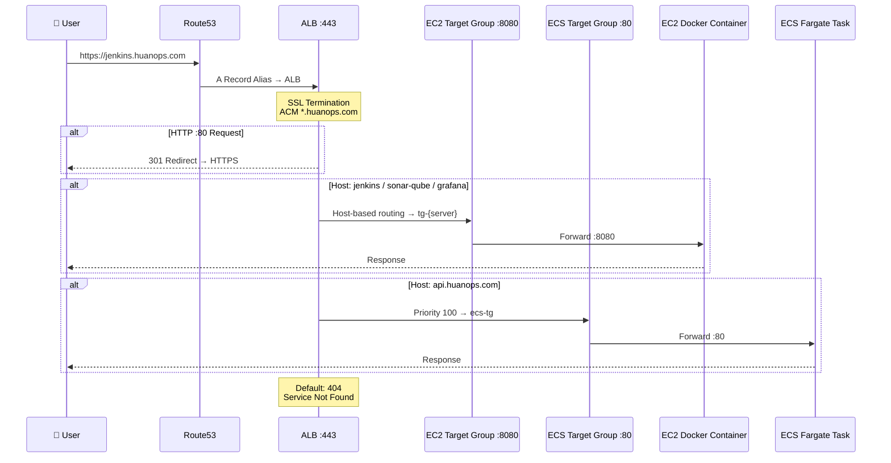
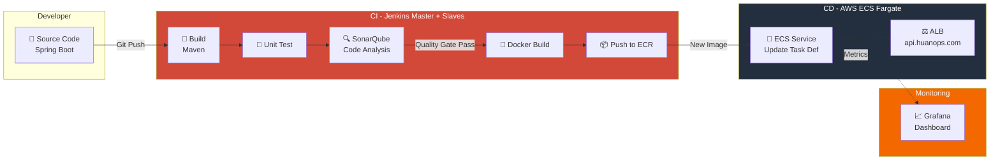
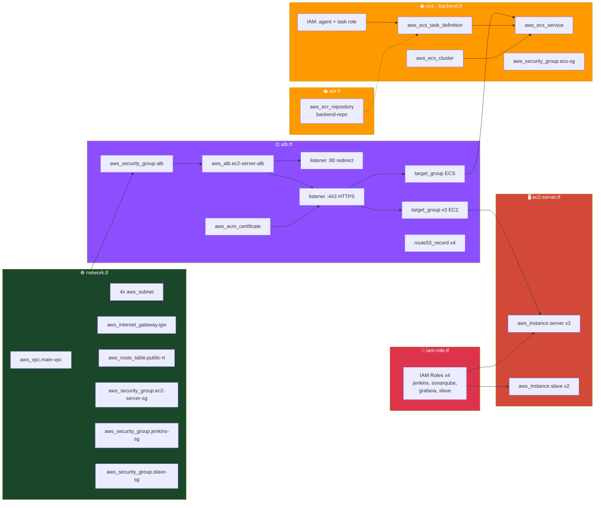

# AWS ECS Fargate CI/CD Pipeline

End-to-End Deployment of a FullStack Web Application (Spring Boot, ReactJS) with AWS ECS Fargate, Terraform, Jenkins, SonarQube, Trivy & CloudWatch/Grafana


## 📋 Mục lục

- [Tổng quan](#-tổng-quan)
- [Kiến trúc hệ thống](#-kiến-trúc-hệ-thống)
- [Sơ đồ Infrastructure](#-sơ-đồ-infrastructure)
- [Cấu trúc thư mục](#-cấu-trúc-thư-mục)
- [Chi tiết Infrastructure](#-chi-tiết-infrastructure)
- [Cách sử dụng](#-cách-sử-dụng)
- [Truy cập các dịch vụ](#-truy-cập-các-dịch-vụ)

---

## 🎯 Tổng quan

Dự án này triển khai một hệ thống CI/CD hoàn chỉnh trên AWS sử dụng Terraform, với 2 phần chính:

### CI/CD Tools (EC2-based)
- **Jenkins** (Master): CI/CD automation server
- **Jenkins Slave** (x2): Build agents với Docker, Java 17, Maven, Git
- **SonarQube**: Code quality & security analysis
- **Grafana**: Monitoring & observability dashboard

### Application Workload (ECS Fargate)
- **ECS Fargate Cluster**: Chạy backend service (Spring Boot) trên containers
- **ECR Repository**: Lưu trữ Docker images cho backend
- **ALB + Route53**: Routing traffic qua `api.huanops.com`

### Chờ triển khai
- **S3 + CloudFront**: Hosting frontend (ReactJS) — *file placeholder*

---

## 🏗️ Kiến trúc hệ thống

### AWS Provider
- **Region**: `ap-southeast-1` (Singapore)
- **Terraform AWS Provider**: Version `~> 6.0`

### Network Architecture

#### VPC Configuration
| Resource | CIDR Block | AZ | Mô tả |
|----------|------------|-----|-------|
| VPC | `10.0.0.0/16` | — | Main VPC với DNS hostnames enabled |
| Public Subnet 1a | `10.0.1.0/24` | `ap-southeast-1a` | Auto-assign public IP |
| Public Subnet 1b | `10.0.2.0/24` | `ap-southeast-1b` | Auto-assign public IP |
| Private Subnet 1a | `10.0.3.0/24` | `ap-southeast-1a` | Reserved |
| Private Subnet 1b | `10.0.4.0/24` | `ap-southeast-1b` | Reserved |

#### Network Components
- **Internet Gateway** (`main-igw`): Cho phép truy cập internet cho public subnets
- **Route Table** (`public-rt`): Route `0.0.0.0/0` → Internet Gateway, gán cho cả 2 public subnets

### Security Groups

#### ALB Security Group (`alb-sg`)
| Direction | Port | Protocol | Source | Mô tả |
|-----------|------|----------|--------|-------|
| Ingress | 443 | TCP | `0.0.0.0/0` | HTTPS access |
| Ingress | 80 | TCP | `0.0.0.0/0` | HTTP access |
| Egress | All | All | `0.0.0.0/0` | All outbound traffic |

#### EC2 Server Security Group (`ec2-server-sg`)
> Dùng cho SonarQube và Grafana

| Direction | Port | Protocol | Source | Mô tả |
|-----------|------|----------|--------|-------|
| Ingress | 8080 | TCP | ALB SG | Web access from ALB |
| Egress | All | All | `0.0.0.0/0` | All outbound traffic |

#### Jenkins Security Group (`jenkins-sg`)
| Direction | Port | Protocol | Source | Mô tả |
|-----------|------|----------|--------|-------|
| Ingress | 8080 | TCP | ALB SG | Web access from ALB |
| Ingress | 8080 | TCP | Slave SG | Jenkins API from slave |
| Ingress | 50000 | TCP | Slave SG | JNLP agent connection |
| Egress | All | All | `0.0.0.0/0` | All outbound traffic |

#### Slave Security Group (`slave-sg`)
| Direction | Port | Protocol | Source | Mô tả |
|-----------|------|----------|--------|-------|
| Egress | All | All | `0.0.0.0/0` | All outbound traffic |

#### ECS Security Group (`ecs-sg`)
| Direction | Port | Protocol | Source | Mô tả |
|-----------|------|----------|--------|-------|
| Ingress | 80 | TCP | ALB SG | HTTP from ALB |
| Egress | All | All | `0.0.0.0/0` | All outbound traffic |

---

## 📊 Sơ đồ Infrastructure

### Tổng quan kiến trúc AWS



### Luồng Traffic (Network Flow)



### CI/CD Pipeline Flow



### Sơ đồ Terraform Resources



---

## 📁 Cấu trúc thư mục

```
.
├── ECS-Deployer-Diagram.svg    # Sơ đồ kiến trúc tổng quan (SVG)
├── JenkinsFile                 # Jenkins pipeline definition (chờ triển khai)
├── README.md
└── infrastructure/
    ├── provider.tf              # AWS Provider (ap-southeast-1, v6.0)
    ├── network.tf               # VPC, Subnets, IGW, Route Tables, Security Groups
    ├── alb.tf                   # ALB, ACM, Route53, Listeners, Target Groups (EC2 + ECS)
    ├── ec2-server.tf            # EC2: Jenkins, SonarQube, Grafana + 2 Slave nodes
    ├── iam-role.tf              # IAM Roles: jenkins, sonarqube, grafana, slave (SSM + ECR)
    ├── ecr.tf                   # ECR Repository: backend-repo
    ├── ecs - backend.tf         # ECS Fargate: Cluster, Task Def, Service, IAM Roles, SG
    ├── outputs.tf               # Terraform outputs (EC2 + Slave info)
    ├── turn-on-system.tf        # EC2 instance state management (ensure running)
    ├── s3-bucket.tf             # (Chờ triển khai - S3 Frontend)
    ├── cloudfront.tf            # (Chờ triển khai - CloudFront CDN)
    └── ec2-install/             # User data scripts
        ├── jenkins.sh           # Jenkins: jenkins/jenkins:lts-jdk21 → :8080
        ├── sonar-qube.sh        # SonarQube: sonarqube:latest → 9000→8080
        ├── grafana.sh           # Grafana: grafana/grafana:latest → 3000→8080
        └── slave.sh             # Slave: Docker + Java 17 + Maven + Git
```

---

## 🖥️ Chi tiết Infrastructure

### EC2 Instances — CI/CD Servers

Tất cả EC2 instances sử dụng:
- **AMI**: `ami-02fb5ef6a4a46a62d` (Amazon Linux)
- **Subnet**: Public Subnet 1a
- **Volume**: gp3, delete on termination
- **IAM Instance Profile**: Mỗi server có role riêng với `AmazonSSMManagedInstanceCore`

| Server | Instance Type | Volume Size | Health Check Path | Docker Image | Port Mapping | Security Group |
|--------|---------------|-------------|-------------------|--------------|--------------|----------------|
| Jenkins | `t3.medium` | 20 GB | `/health` | `jenkins/jenkins:lts-jdk21` | 8080:8080 | `jenkins-sg` |
| SonarQube | `t3.medium` | 20 GB | `/api/system/status` | `sonarqube:latest` | 8080:9000 | `ec2-server-sg` |
| Grafana | `t3.medium` | 20 GB | `/api/health` | `grafana/grafana:latest` | 8080:3000 | `ec2-server-sg` |

### EC2 Instances — Jenkins Slaves

| Server | Instance Type | Volume Size | IAM Policy | Software |
|--------|---------------|-------------|------------|----------|
| Slave-1 | `t3.medium` | 20 GB | `AmazonEC2ContainerRegistryFullAccess` + SSM | Docker, Java 17, Maven, Git |
| Slave-2 | `t3.medium` | 20 GB | `AmazonEC2ContainerRegistryFullAccess` + SSM | Docker, Java 17, Maven, Git |

> Slave nodes kết nối Jenkins Master qua JNLP (port 50000) và có quyền push Docker images lên ECR.

### ECS Fargate — Backend Service

| Property | Value |
|----------|-------|
| Cluster | `backend-cluster` |
| Service | `backend-service` (desired count: 1) |
| Task Family | `backend-task` |
| Launch Type | `FARGATE` |
| CPU / Memory | 1024 / 2048 |
| Network Mode | `awsvpc` |
| Container Port | 80 |
| Current Image | `public.ecr.aws/nginx/nginx:stable-perl-amd64` (placeholder) |
| Subnets | Public Subnet 1a, 1b |
| Security Group | `ecs-sg` |

**IAM Roles:**
- **Execution Role** (`ecs-agent-role`): `AmazonECSTaskExecutionRolePolicy` — pull images, push logs
- **Task Role** (`ecs-task-role`): `AmazonECSTaskExecutionRolePolicy` — runtime permissions

### ECR Repository

| Property | Value |
|----------|-------|
| Name | `backend-repo` |
| Tag Mutability | MUTABLE |
| Scan on Push | Enabled |

### Application Load Balancer

- **Name**: `ec2-server-alb`
- **Type**: Application Load Balancer (internet-facing)
- **Subnets**: Public Subnet 1a, 1b

#### Listeners & Routing

| Port | Protocol | Action |
|------|----------|--------|
| 80 | HTTP | Redirect to HTTPS (301) |
| 443 | HTTPS | Host-based routing → Target Groups |

**Routing Rules:**

| Priority | Host Header | Target Group | Target Type | Port |
|----------|-------------|--------------|-------------|------|
| 10+ | `jenkins.huanops.com` | `tg-jenkins` | instance | 8080 |
| 10+ | `sonar-qube.huanops.com` | `tg-sonar-qube` | instance | 8080 |
| 10+ | `grafana.huanops.com` | `tg-grafana` | instance | 8080 |
| 100 | `api.huanops.com` | `ecs-tg` | ip | 80 |
| Default | — | — | — | 404 |

### SSL/TLS Certificate

- **Domain**: `huanops.com` (wildcard: `*.huanops.com`)
- **Provider**: AWS Certificate Manager (ACM)
- **Validation**: DNS validation via Route53 (tự động)

### DNS Configuration (Route53)

| Subdomain | Target |
|-----------|--------|
| `jenkins.huanops.com` | ALB (A Record Alias) |
| `sonar-qube.huanops.com` | ALB (A Record Alias) |
| `grafana.huanops.com` | ALB (A Record Alias) |
| `api.huanops.com` | ALB (A Record Alias) |

### IAM Roles

| Role | Service | Policies |
|------|---------|----------|
| `jenkins` | EC2 | `AmazonSSMManagedInstanceCore` |
| `sonarqube` | EC2 | `AmazonSSMManagedInstanceCore` |
| `grafana` | EC2 | `AmazonSSMManagedInstanceCore` |
| `slave` | EC2 | `AmazonEC2ContainerRegistryFullAccess`, `AmazonSSMManagedInstanceCore` |
| `ecs-agent-role` | ECS Tasks | `AmazonECSTaskExecutionRolePolicy` |
| `ecs-task-role` | ECS Tasks | `AmazonECSTaskExecutionRolePolicy` |

---

## 🚀 Cách sử dụng

### Prerequisites

1. AWS CLI configured với credentials
2. Terraform installed (>= 1.0)
3. SSH key pair tại `~/.ssh/ec2-server.pub`
4. Domain `huanops.com` được quản lý trên Route53

### Triển khai

```bash
# Di chuyển vào thư mục infrastructure
cd infrastructure

# Khởi tạo Terraform
terraform init

# Xem trước các thay đổi
terraform plan

# Triển khai infrastructure
terraform apply
```

### Xem thông tin Instances

```bash
# Thông tin CI/CD servers (Jenkins, SonarQube, Grafana)
terraform output ec2-info

# Thông tin Jenkins slave nodes
terraform output slave
```

Output hiển thị: Instance ID, Public/Private IP & DNS, Instance Type, IAM Profile, State, Tags.

---

## 🌐 Truy cập các dịch vụ

Sau khi triển khai thành công, truy cập các dịch vụ qua HTTPS:

| Service | URL | Flow |
|---------|-----|------|
| Jenkins | https://jenkins.huanops.com | ALB :443 → EC2 :8080 → Container :8080 |
| SonarQube | https://sonar-qube.huanops.com | ALB :443 → EC2 :8080 → Container :9000 |
| Grafana | https://grafana.huanops.com | ALB :443 → EC2 :8080 → Container :3000 |
| Backend API | https://api.huanops.com | ALB :443 → ECS Fargate :80 |

---

## 📝 Ghi chú

### Files chưa triển khai
- `JenkinsFile`: Jenkins pipeline definition
- `s3-bucket.tf`: S3 Bucket cho Frontend Static (ReactJS)
- `cloudfront.tf`: CloudFront CDN distribution

### Docker Containers (EC2)
- **Persistent volumes** để lưu trữ data
- **Auto-restart policy** (`--restart always`)
- **Port mapping** về port 8080 cho ALB health check
- **User data scripts** tự động cài Docker và chạy container khi EC2 khởi tạo

### Terraform Patterns
- **`for_each`** trên `server_definitions` và `slave_definitions`: EC2, Target Groups, Listener Rules, DNS Records
- **`locals`** cho security group mapping: Jenkins dùng `jenkins-sg`, còn lại dùng `ec2-server-sg`
- **`depends_on`** đảm bảo thứ tự: ACM → ALB Listener, EC2 → Instance State → Output

---

## 🔐 Bảo mật

- HTTPS được enforce với redirect từ HTTP → HTTPS
- SSL certificate wildcard `*.huanops.com` validate qua DNS tự động
- **Jenkins** có security group riêng, chỉ cho phép ALB và Slave truy cập
- **Slave** chỉ có egress, không expose port nào
- **ECS** chỉ cho phép traffic từ ALB (port 80)
- EC2 servers không mở SSH (truy cập qua **SSM Session Manager** nhờ IAM role)
- Slave có quyền **ECR Full Access** để push Docker images

---

## 📊 Monitoring

- **Grafana**: Dashboard visualization, đã triển khai tại `grafana.huanops.com`
- **CloudWatch**: Thu thập logs và metrics từ ECS (dự kiến)

---

## 🏷️ Tags

Tất cả resources được tag với:
- `Project`: `ECS-CI/CD`
- `Name`: Tên resource tương ứng
